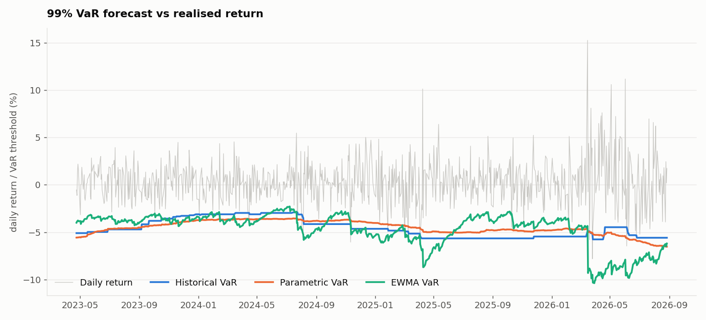
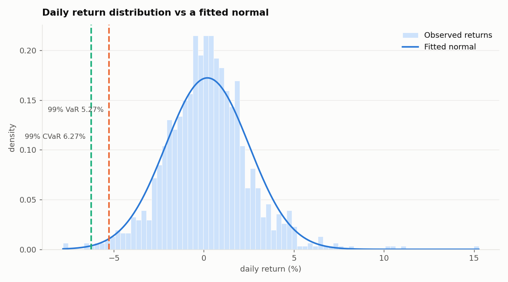
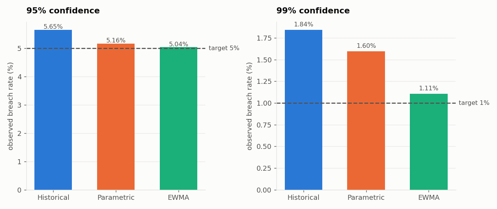
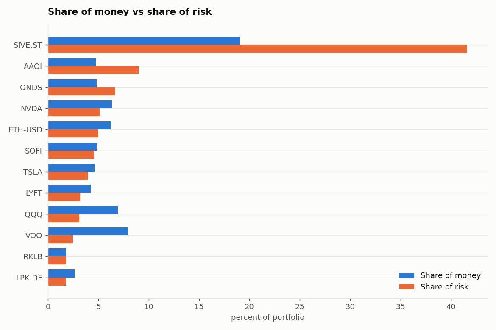
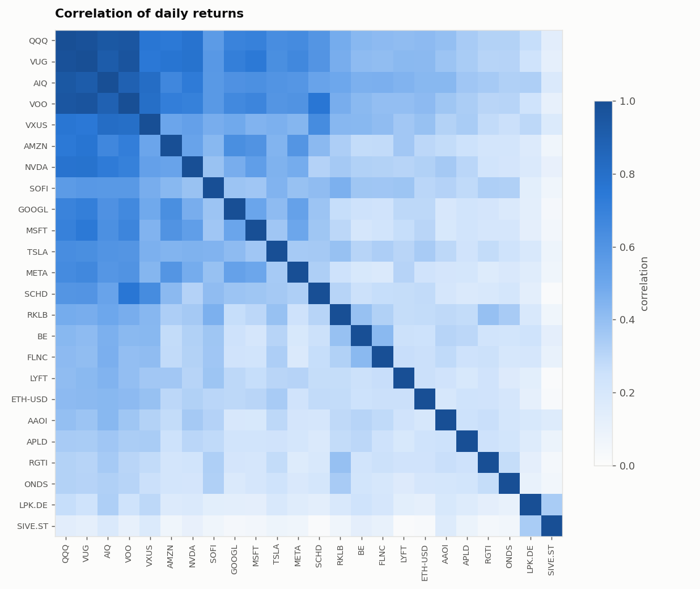

# Portfolio Risk Management

**How much money could this portfolio lose on a bad day?**

That is the whole question. This project answers it for a real 24-asset
portfolio, using three different methods, and then tests all three to find out
which ones are actually right.

Two of the three turn out to be wrong.

---

## What "Value at Risk" means

Imagine writing down what your portfolio did every day for 100 days, one number
per card. Then sort the cards, worst loss on the left.

Count five cards in from the worst end. That card is your **95% VaR**. It means
95 days out of 100 were better than that, and 5 were worse.

VaR is not your worst case. It marks where the bad days start, and then it goes
quiet about how bad they get. **Conditional VaR** (CVaR) answers that second
question by averaging every card past the cutoff.

---

## The main result

Anyone can calculate VaR. The real test is whether the number holds up on days
the model has never seen. So the model is built using only old data, then judged
on the next day, over and over, 814 times.

| Method | 95% | 99% |
|---|---|---|
| Historical | PASS | **FAIL** |
| Parametric | PASS | **FAIL** |
| **EWMA** | **PASS** | **PASS** |

All three looked fine when tested on the same data used to build them. Only
one survived being tested honestly.



Look at the three coloured lines. Each one is a prediction of "how bad could
tomorrow be". The blue line is a staircase: it sits still for months, then
jumps. The orange line drifts slowly. The green line reacts within days when
the market gets rough. That difference is the whole story.

---

## The portfolio

24 holdings worth $39,618, priced every trading day from **2022-04-14 to
2026-08-27**. That is 1,064 days. Mostly US stocks and index funds, plus one
crypto holding and two European stocks converted into dollars.

| | |
|---|---|
| Yearly swing (volatility) | 36.7% |
| Average swing of a single holding | 64.8% |
| Worst day | −7.82% (2026-03-26) |
| Best day | +15.26% (2026-03-16) |

The portfolio swings less than the average holding inside it. That gap is
diversification doing its job.

---

## The three methods

**Historical.** Sort the past returns and read off the cutoff. Makes no
assumptions, but it only knows about losses it has already lived through.

**Parametric.** Assume returns follow a bell curve, then describe the whole tail
using just an average and a standard deviation. Always has an answer, even for
losses never seen. But if returns are not bell-shaped, it is confidently wrong.

**EWMA.** Identical to parametric, with one change: recent days count more than
old ones. (λ = 0.94, the RiskMetrics industry standard, which works out to
roughly a 17-day memory.)

**Monte Carlo.** Simulate 100,000 imaginary tomorrows that move together the way
the real holdings do, using a technique called Cholesky decomposition.

---

## What was found

### 1. Returns are not bell-shaped, and at 95% it barely matters

```
skew            : +0.54     (0 would be perfectly even)
excess kurtosis : +2.99     (0 would be normal-sized tails)
Jarque-Bera p   : 5.98e-98  (normality rejected)
```

That p-value is about as decisive as statistics gets. And yet parametric VaR
lands within 0.2 percentage points of historical VaR.

Two mistakes cancelled out. Big *upward* jumps (one holding rose 74% in a day)
make the standard deviation look larger, which pushes the estimate up. Fat tails
push it down. The two roughly balance.

The balance breaks the further into the tail you look:

| Confidence | Parametric minus historical (VaR) | (CVaR) |
|---|---|---|
| 95.0% | +0.18% | −0.02% |
| 99.0% | −0.08% | −0.30% |
| 99.5% | −0.21% | −0.35% |

CVaR is understated at **every** level, and it gets worse further out. The bell
curve finds roughly the right doorway into the bad zone, then underestimates how
deep the room is.



### 2. Monte Carlo just repeated the parametric answer

The simulation matched reality exactly on volatility: 2.315% simulated against
2.315% actual. So the correlation machinery works.

But its VaR came within 0.03 points of parametric at every level, because the
random numbers were drawn from a bell curve, which is the very assumption the
data rejects.

**A simulation is only as realistic as the distribution you feed it.** Building
a sophisticated engine does not help if the inputs carry the same flaw.

### 3. Two methods fail at 99%, and they fail the same way

Every forecast below uses only prior data and is judged on a day it never saw.

| Method | Conf | Expected breaches | Actual | Count test | Timing test | Overall |
|---|---|---|---|---|---|---|
| Historical | 95% | 40.7 | 46 | 0.403 | 0.391 | PASS |
| Historical | 99% | 8.1 | 15 | 0.031 | 0.027 | **FAIL** |
| Parametric | 95% | 40.7 | 42 | 0.835 | 0.235 | PASS |
| Parametric | 99% | 8.1 | 13 | 0.115 | **0.014** | **FAIL** |
| EWMA | 95% | 40.7 | 41 | 0.962 | 0.204 | PASS |
| EWMA | 99% | 8.1 | **9** | 0.766 | 0.654 | **PASS** |

A "breach" is a day that lost more than the model predicted. At 99% confidence
you should get about 8 in 814 days. Historical got 15.

Two separate tests run here. The **count test** (Kupiec) asks whether the number
of breaches is right. The **timing test** (Christoffersen) asks whether they are
spread out or bunched together.

Parametric **passed the count test and still failed**, because its breaches came
in clusters. Counting alone would have given it a clean bill of health.

| Method at 99% | Chance of a breach after a calm day | After a breach |
|---|---|---|
| Historical | 1.63% | 13.33% |
| Parametric | 1.38% | 15.38% |
| EWMA | 1.12% | **0.00%** |

One bad day made the next bad day about **eleven times more likely**. Rough days
come in streaks, and a model that looks back 250 days with everything weighted
equally treats a day from fourteen months ago as seriously as yesterday. It
reacts far too slowly.

### 4. The fix came from the diagnosis

The timing test said the model reacts too slowly. So weight recent days more
heavily. That is the only change: same bell curve, same average, same formula.
Only the weighting of the volatility estimate differs.

Breaches fell from 15 and 13 down to **9, against 8.1 expected**. Back-to-back
breaches went from 2 to zero.

**Nothing was tuned to make this pass.** λ = 0.94 is the standard industry
value, chosen before the result was known.



### 5. One holding carries 42% of the risk

| | Share of money | Share of risk | Own volatility |
|---|---|---|---|
| SIVE.ST | 19.05% | **41.56%** | 114.3% |
| AAOI | 4.77% | 9.02% | 129.9% |
| ONDS | 4.85% | 6.68% | 118.8% |
| **Top 3** | **28.7%** | **57.3%** | |

Position size and risk are not the same thing. Sivers is a fifth of the money
and over two-fifths of the risk, because it swings 114% a year.

The four index funds are the mirror image: **19.6% of the money, 7.8% of the
risk.** They overlap heavily with each other, but they are also the ballast
steadying everything else.



### 6. Twenty-four holdings, but only about four real bets

```
holdings                      : 24
effective positions (by size) :  13.4
effective bets (by risk)      :   3.9
diversification ratio         :   1.77
```

Owning 24 things is not the same as making 24 bets.

Dropping from 24 to 13.4 happens because the money is spread unevenly. Dropping
from 13.4 to **3.9** happens because the holdings move together. Once that is
accounted for, the portfolio behaves like a four-asset book.

Out of all 276 pairs of holdings, the lowest correlation is **0.014**, and **not
one pair is negative.** Nothing in this portfolio reliably rises when the rest
falls.



The dark block in the corner is QQQ, VUG, AIQ and VOO. Statistically they are
close to one holding owned four times (QQQ and VUG correlate at 0.982). That
overlap makes the covariance matrix unstable, with a condition number of
**16,428**, meaning small errors in the input get amplified a lot.

---

## Bugs found along the way

Three data problems were found and fixed. Each one produced output that looked
perfectly fine and numbers that were quietly wrong.

**Weekend prices were being invented.** Crypto trades on weekends, stocks do not.
Pandas silently filled in Saturday and Sunday stock prices by copying Friday,
creating about 500 fake days where nothing moved. That would have made the
portfolio look far calmer than it is.

**Every Monday was being deleted.** Returns were calculated before removing
incomplete days, so Monday was compared against a missing Sunday and came out
blank. Around 227 Mondays vanished. Mondays absorb weekend news and are more
volatile than average, so losing them would have made the risk estimates too low.

**A foreign listing was reporting a day late.** One holding was read from its
Frankfurt listing, which reported a 43% crash a full day after it actually
happened, and exaggerated a later jump (+107% versus the real +74%). A one-day
delay ruins that holding's relationship with everything else. Switched to the
main Stockholm listing.

That last fix changed real numbers: the worst day moved from −9.01% to −7.82%,
and the best from +21.58% to +15.26%.

---

## What this does not tell you

- **Weights are assumed constant**, which means rebalancing back to target every
  single day. Real portfolios drift.
- **Today's holdings are applied to the past.** The question answered is "how
  risky would my current portfolio have been", not "what did my account do".
- **Parametric, EWMA and Monte Carlo all assume a bell curve**, which this data
  rejects. EWMA fixed the *timing* of risk, not the shape of the distribution.
- **The tests are weak at 99%.** With only about 8 expected breaches, the timing
  test cannot detect much. EWMA's zero back-to-back breaches means *no evidence
  of clustering*, not proof that there is none.
- **One portfolio, one time period.** These results describe this book over these
  four years. They do not prove EWMA is better in general.
- **Correlations rise in a crisis.** Holdings that look independent in calm
  markets tend to fall together when everyone sells at once, so the
  diversification measured here is optimistic exactly when it matters most.
- **FLY was excluded.** It listed in August 2025, and keeping it would have cut
  the usable history to 267 days and left only 17 days to test on.

---

## Running it

```bash
python3 -m venv .venv && source .venv/bin/activate
pip install yfinance pandas numpy scipy matplotlib

python data.py         # download prices, convert to USD, build returns
python portfolio.py    # position sizes and portfolio returns
python var.py          # historical / parametric VaR and CVaR
python montecarlo.py   # covariance checks and simulation
python backtest.py     # the honest out-of-sample test
python risk.py         # who actually carries the risk
python charts.py       # all figures
```

The end date is fixed in `data.py` on purpose. A partly finished trading day
would give a number that changes every time you run it.

## Files

```
data.py         prices, currency conversion, returns
portfolio.py    position sizes, weights, portfolio returns
var.py          the three VaR methods, CVaR, normality tests
montecarlo.py   covariance checks, correlated simulation
backtest.py     rolling out-of-sample test, Kupiec and Christoffersen
risk.py         risk contribution, effective bets
charts.py       figures
figures/        generated images
```
